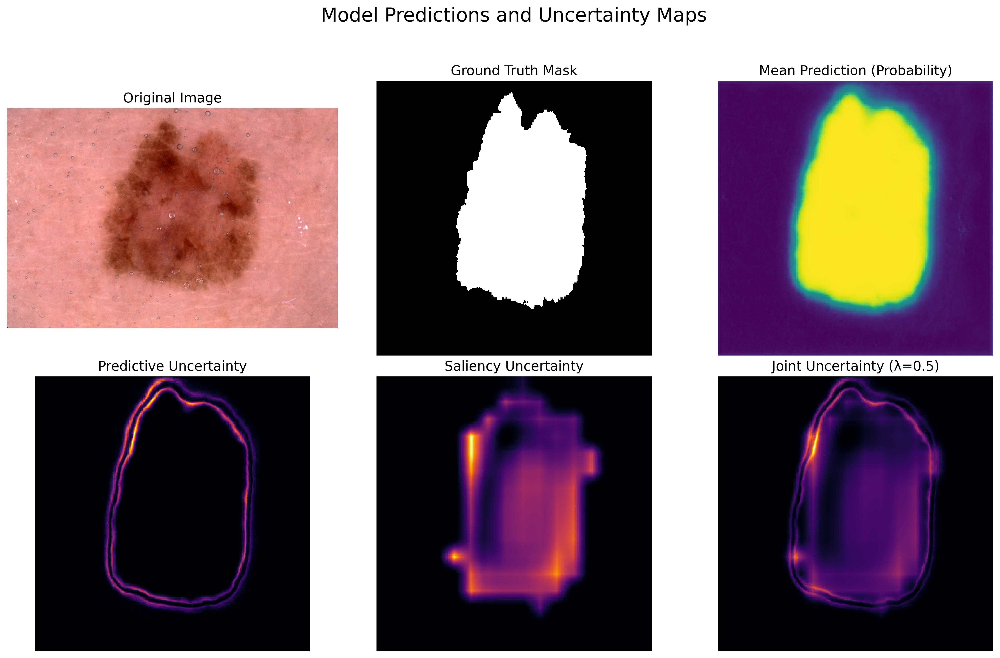

# Fusing Predictive and Saliency Variance for Uncertainty Calibration

This repository contains the official implementation for the paper "On the Fusion of Predictive and Saliency Variance for Uncertainty Calibration in Medical Image Segmentation". We investigate whether combining predictive uncertainty (from MC Dropout) and saliency uncertainty (from Grad-CAM variance) can improve model calibration in medical image segmentation.

Our key finding is a **null result**: for skin lesion segmentation, a simple fusion of these two uncertainty types does not improve, and in fact degrades, calibration performance compared to using predictive variance alone. We present this as a valuable finding to guide future research in trustworthy AI.



---

## Core Concepts

* **U-Net Implementation** for semantic segmentation in PyTorch.
* **Uncertainty Quantification (UQ)** via Monte Carlo (MC) Dropout.
* **Explainable AI (XAI)** using Gradient-weighted Class Activation Mapping (Grad-CAM).
* **Novel Uncertainty Fusion:** A method to fuse predictive and saliency variance into a joint score.
* **Robust Calibration Evaluation:** Uses foreground-only Expected Calibration Error (ECE) for a fair metric in segmentation tasks.

---

## Setup and Installation

### Prerequisites

* Python 3.9+
* PyTorch
* Other dependencies listed in `requirements.txt`

### Installation

1.  **Clone the repository:**
   
```
git clone <your-repository-url>
cd <your-repository-name>
```

2.  **Install dependencies:**
   
```pip install -r requirements.txt ```

---

## Dataset

This project uses the **ISIC 2018 Task 1: Lesion Boundary Segmentation** dataset.

1.  Download the dataset from the official [ISIC Challenge website](https://challenge.isic-archive.com/data/).
2.  Organize the data into the following directory structure inside the `data/` folder:

    ```
    /data/
    └── ISIC2018/
        ├── ISIC2018_Task1-2_Training_Input/
        │   ├── ISIC_0000000.jpg
        │   └── ...
        └── ISIC2018_Task1_Training_GroundTruth/
            ├── ISIC_0000000_segmentation.png
            └── ...
    ```

---

## Usage: Reproducing Results

The entire workflow can be run using the provided scripts.

### Step 1: Train Model & Generate Uncertainty Maps

The `main.py` script handles training the U-Net model, saving the best weights, and then using that model to generate all the necessary uncertainty maps for the validation and test sets.

This process is computationally intensive and may take a significant amount of time. The results will be saved in the `results/` directory.

```python main.py```

### Step 2: Generate Visualizations

To generate the qualitative figures used in the paper, run the live visualization script. This will pick a random image and generate its visualization on the fly.

```python visualize.py```

---

## File Structure

* `main.py`: Main script to run the full pipeline (training + map generation).
* `visualize.py`: Generates the qualitative result figures.
* `model.py`: U-Net architecture definition.
* `dataset.py`: PyTorch `Dataset` class for data loading and augmentation.
* `train.py` / `uncertainty.py`: Core logic modules (used by `main.py`).
* `requirements.txt`: Project dependencies.
* `results/`: Default output directory for weights, maps, and figures.

---

## Citing Our Work

If you use this code or our findings in your research, please consider citing our work.
```
@article{Withanachchi2025Fusion,
  title   = {On the Fusion of Predictive and Saliency Variance for Uncertainty Calibration in Medical Image Segmentation},
  author  = {Withanachchi, R.R.M. and Bandara, H.G.U.N. and Madawalage, D.M.K.T.K.},
  year    = {2025},
  journal = {arXiv preprint}
}
```
---

## License

This project is licensed under the MIT License.
